
 
  

### Application Desktop qui assiste à trouver des recettes de cuisine selon les besoins du Chef et les produits disponibles !

 

## Interface utilisateur

## Français

 
  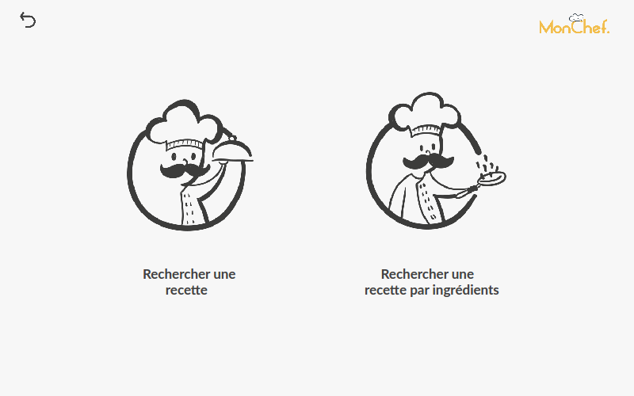
  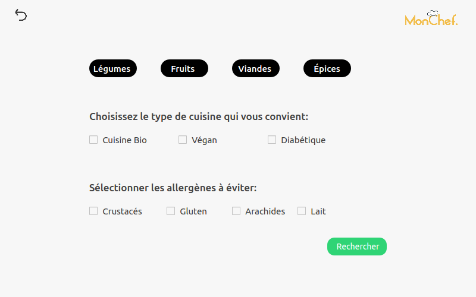
  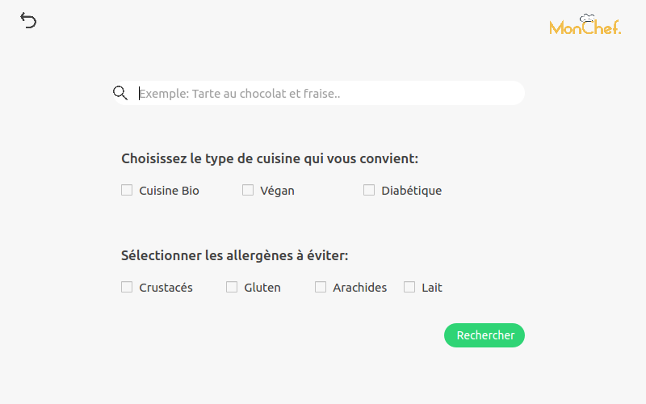
  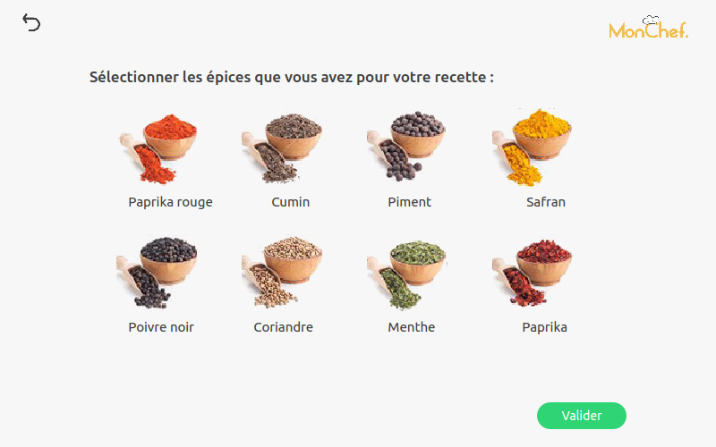
  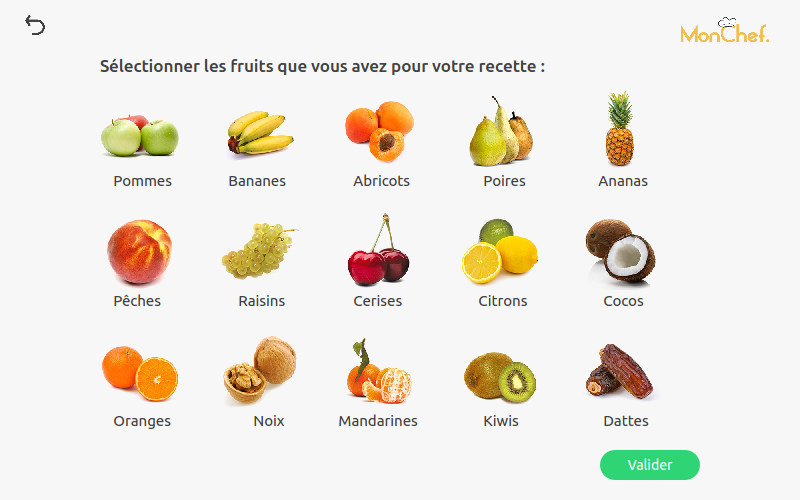
  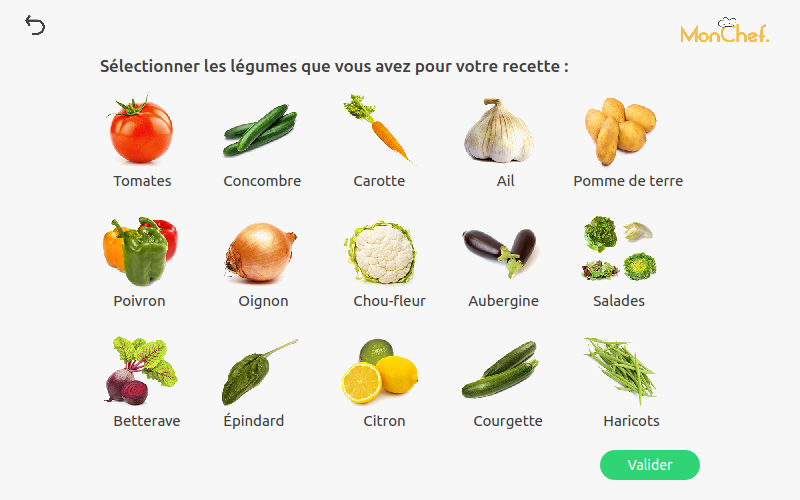
  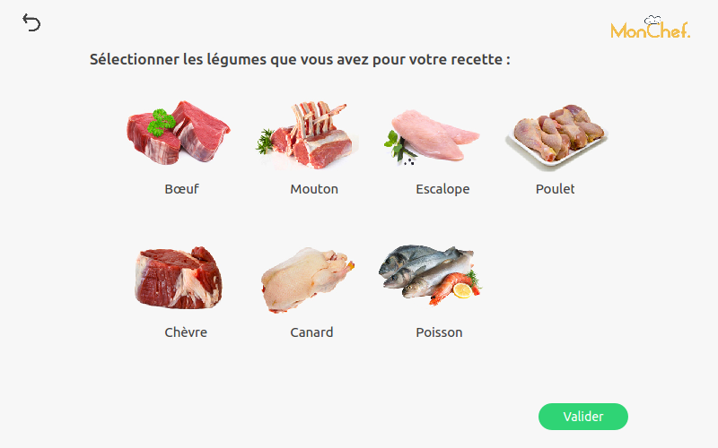
  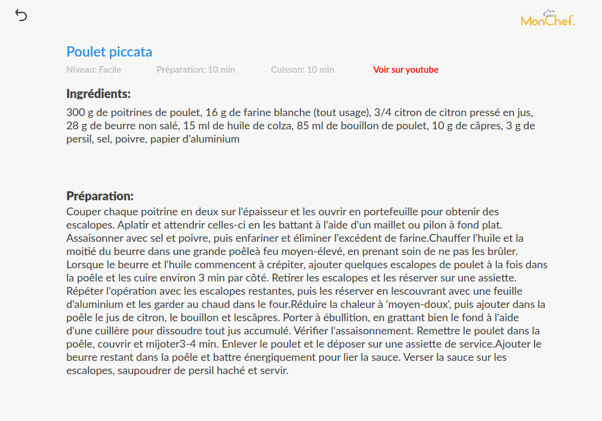
  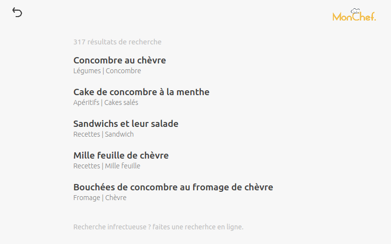

## Arabe

 
  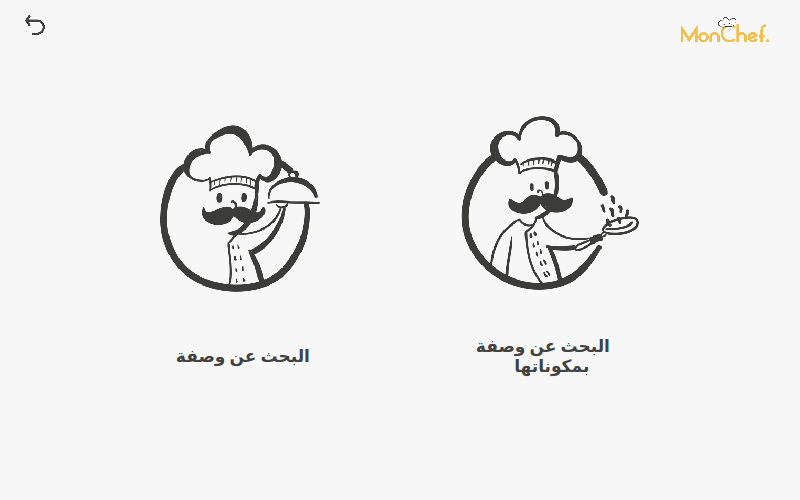
  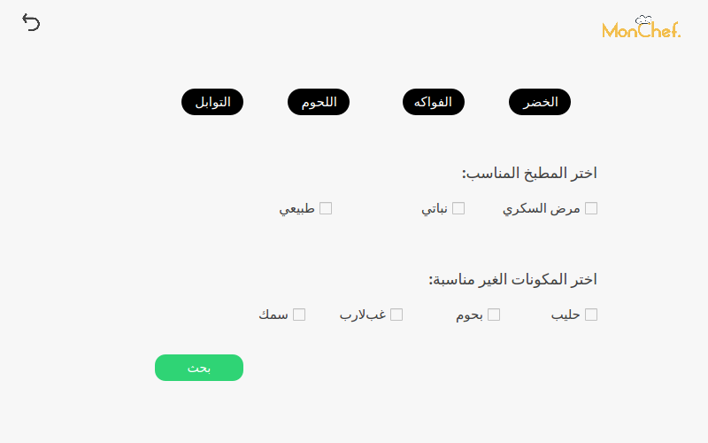
  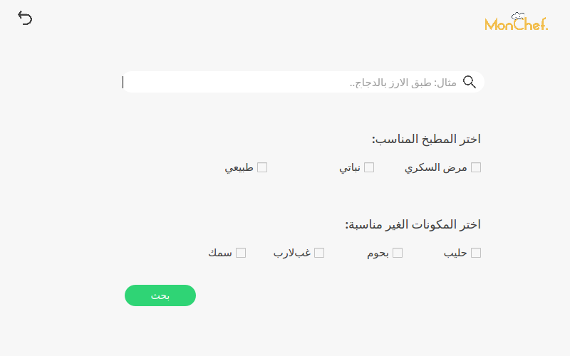
  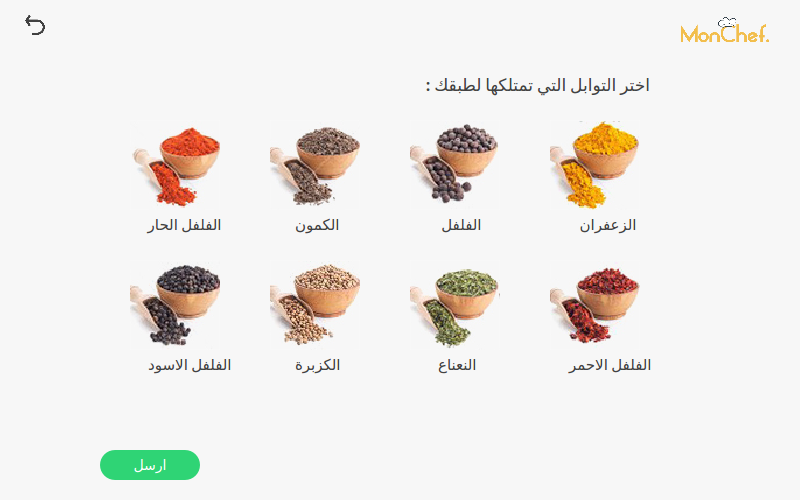
  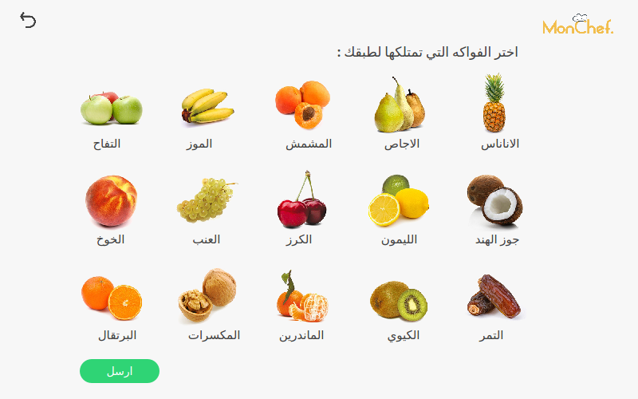
  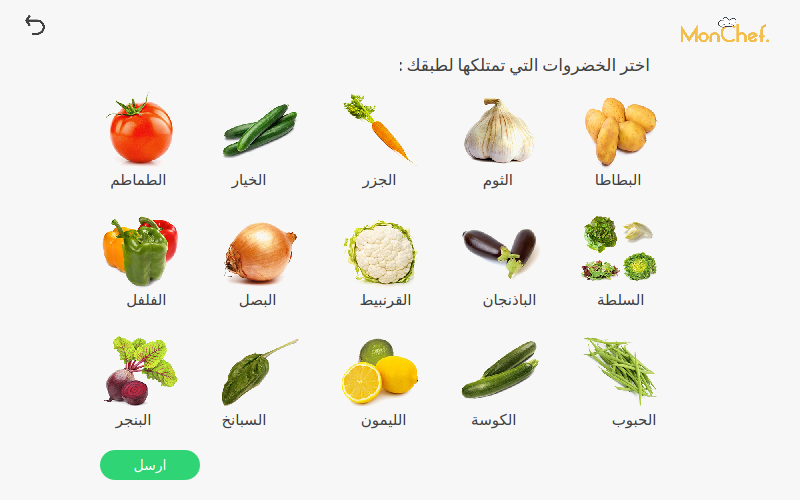
  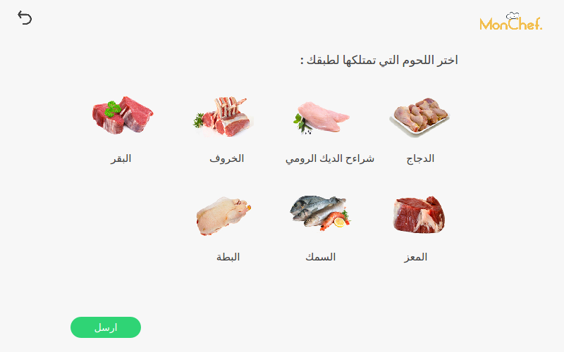

